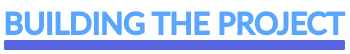

<h1
  align="center"
>
  
</h1>

  Project created with React.js, Next.js and TypeScript in BootCamp **[Next Level Week](https://nextlevelweek.com/)** of the  **[Rocketseat Community](https://github.com/rocketseat)** during February 22 to 28, 2021, with instructor **[Diego Fernandez](https://github.com/diego3g)**. The application aims to move and exercise the body when we spend a lot of time in front of the screen, the system works with gamified challenges to make the application more fun and dynamic.

  &nbsp;
  &nbsp;
  &nbsp;
    

<h4
  align="center"
>
  🔥 Project under Construction...  🔥
</h4>

<h3
  align="center"
>
  
</h3>

  &nbsp;&nbsp;&nbsp;
  &nbsp;&nbsp;&nbsp;
  &nbsp;&nbsp;&nbsp;
  &nbsp;&nbsp;&nbsp;
  &nbsp;&nbsp;&nbsp;
  

## **Building the Project**
 
<h4
  align="capitalize"
>
Here is a list of what was seen and studied during the fourth edition of Next Level Week
</h4> 

:white_check_mark: First Class - React Basics

Project presentation, how APIS works, initial concepts, React fundamentals such as Components, Properties and Status, external source configuration, global styling and creation of the ExperienceBar component.

 

:white_check_mark: Secont Class - Unraveling Next.js

Knowing Next.js, understanding SPA, SSR and SSG, and when to use certain technology, creating a React application with Next.js, migrating our project, reviewing the project structure. Creating Profile components, CompletedChallenges CountDown and hooking the CountDown component.

:white_check_mark: Third Class - Context and Components

Finalization of the CountDown Component and creation of the ChallenteBox Component, creation React Context, creation challenge context.

 

:white_check_mark: Fourth Class - Improving the usability of the Application

Structure Leveling, Web Notification and playing an audio in the challenge.

 

:white_check_mark: Thursday Class - Challenges and Deploy

Learning opportunities

 

## **Layout**

 
<h3> To access the original layout of this project, access the link below: </h3>
 

<https://www.figma.com/file/ge20pu3ofMOKoliUyKx1Nl/Move.it-1.0/duplicate>

 
(I don't know how long Rocketseat will keep this layout available).
  

## **Technologies**

 

The technologies used until then in the construction of the project:

  
    
  &nbsp;
  
    
  &nbsp;
  
    
  &nbsp;
  
    
  &nbsp;
  
    
  &nbsp;
  
    
  &nbsp;
  
    
  &nbsp;
  
    
  

   

## **Screens**

 

## **Road map**

 

## **About me**
