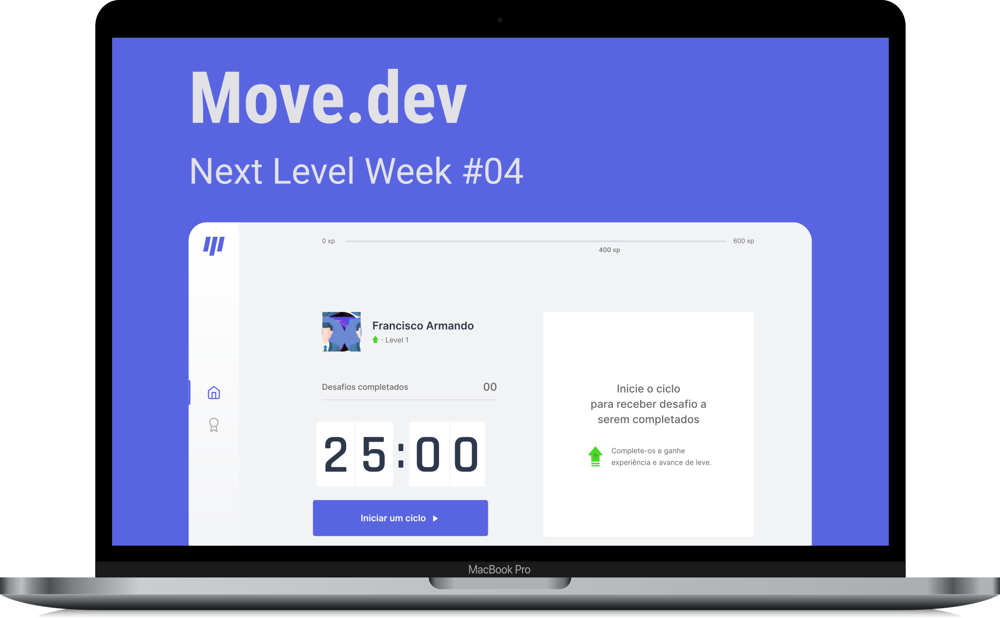

<h1
  align="center"
>
  
</h1>

  Project created with React.js, Next.js and TypeScript in BootCamp **[Next Level Week](https://nextlevelweek.com/)** of the  **[Rocketseat Community](https://github.com/rocketseat)** during February 22 to 28, 2021, with instructor **[Diego Fernandez](https://github.com/diego3g)**. The application aims to move and exercise the body when we spend a lot of time in front of the screen, the system works with gamified challenges to make the application more fun and dynamic.

<h4
  align="center"
>
  🔥 Project under Construction...  🔥
</h4> 

<h3
  align="center"
>
  
</h3>

  <a
    href="#building"
  >
    BUILDING THE PROJECT
  </a>&nbsp;&nbsp; | &nbsp;&nbsp;
  <a
    href="#tech"
  >
    TECHS
  </a>&nbsp;&nbsp; | &nbsp;&nbsp;
  <a
    href="#screens"
  >
    SCREENS
  </a>&nbsp;&nbsp; | &nbsp;&nbsp;
  <a
    href="#author"
  >
    ABOUT ME
  </a>

 

## 🏃🏻‍♂️💜 **Building the Project**

 

- [x] First Class - Towards the Next Level

Project presentation, how APIS works, initial concepts, React fundamentals such as Components, Properties and Status, external source configuration, global styling and creation of the ExperienceBar component.

 

- [x] Secont Class - Unraveling Next.js

Knowing Next.js, understanding SPA, SSR and SSG, and when to use certain technology, creating a React application with Next.js, migrating our project, reviewing the project structure. Creating Profile components, CompletedChallenges CountDown and hooking the CountDown component.

- [ ] Third Class - Context and Components

Finalization of the CountDown Component and creation of the ChallenteBox Component

 

## 🛠 **Technologies**

 

The technologies used until then in the construction of the project:

  
    
  &nbsp;
  
    
  &nbsp;
  
    
  &nbsp;
  
    
  &nbsp;
  
    
  &nbsp;
  
    
  &nbsp;
  
    
  &nbsp;
  
    
  

   

## 📸 **SCREENS**

 

##  **ABOUT ME**
